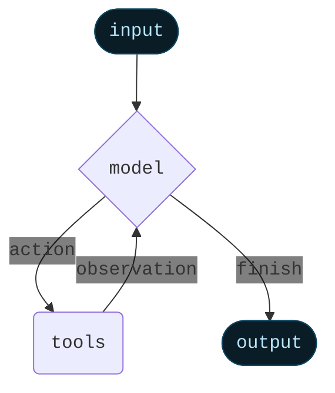
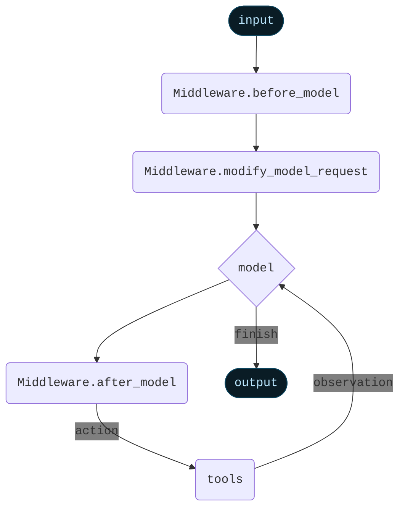

import AlphaCallout from '/snippets/alpha-lc-callout.mdx';

<AlphaCallout />


Middleware provides a way to more tightly control what happens inside the agent.

The core agent loop involves calling a `model`, letting it choose `tools` to execute, and then finishing when it calls no more tools.


<Card>

</Card>

Middleware provides control over what happens before and after those steps.
Each middleware can add in three different types of modifiers:

:::python
- `before_model`: Runs before model execution. Can update state or jump to a different node (`model`, `tools`, `end`)
- `modify_model_request`: Runs before model execution, to prepare the model request object. Can only modify the current model request object (no permanent state updates) and cannot jump to a different node.
- `after_model`: Runs after model execution, before tools are executed. Can update state or jump to a different node (`model`, `tools`, `END`)
:::
:::js
- `beforeModel`: Runs before model execution. Can update state or jump to a different node (`model`, `tools`, `end`)
- `modifyModelRequest`: Runs before model execution, to prepare the model request object. Can only modify the current model request object (no permanent state updates) and cannot jump to a different node.
- `afterModel`: Runs after model execution, before tools are executed. Can update state or jump to a different node (`model`, `tools`, `end`)
:::

:::python
An agent can contain `before_model`, `modify_model_request`, or `after_model` middleware. All three do not need to be implemented.
:::
:::js
An agent can contain multiple middleware. Each middleware does not need to implement all three of `beforeModel`, `modifyModelRequest`, `afterModel`.
:::

<Card>

</Card>

## Using in an agent

:::python
You can use middleware in an agent by passing it `create_agent`:
```python
from langchain.agents import create_agent
from langchain.agents.middleware import SummarizationMiddleware, HumanInTheLoopMiddleware

agent = create_agent(
    ...,
    middleware=[SummarizationMiddleware(), HumanInTheLoopMiddleware()],
    ...
)
```
:::
:::js
```typescript
import { createAgent } from "langchain";
import { summarizationMiddleware, humanInTheLoopMiddleware } from "langchain/middleware";

const agent = createAgent({
    // ...
    middleware: [summarizationMiddleware, humanInTheLoopMiddleware],
    // ...
});
```
:::

Middleware is highly flexible and replaces some other functionality in the agent.
As such, when middleware are used, there are some restrictions on the arguments used to create the agent:
:::python
- `model` must be either a string or a `BaseChatModel`. Will error if a function is passed. If you want to dynamically control the model, use `AgentMiddleware.modify_model_request`
- `prompt` must be either a string or None. Will error if a function is passed. If you want to dynamically control the prompt, use `AgentMiddleware.modify_model_request`
- `pre_model_hook` must not be provided. Use `AgentMiddleware.before_model` instead.
- `post_model_hook` must not be provided. Use `AgentMiddleware.after_model` instead.
:::
:::js
- `model` must be either a string or a BaseChatModel. Will error if a function is passed. If you want to dynamically control the model, use `AgentMiddleware.modifyModelRequest`
- `prompt` must be either a string or None. Will error if a function is passed. If you want to dynamically control the prompt, use `AgentMiddleware.modifyModelRequest`
- `preModelHook` must not be provided. Use `AgentMiddleware.beforeModel` instead.
- `postModelHook` must not be provided. Use `AgentMiddleware.afterModel` instead.
:::

## Built-in middleware

LangChain provides several built in middleware to use off-the-shelf

- [Summarization](#summarization)
- [Human-in-the-loop](#human-in-the-loop)
- [Anthropic prompt caching](#anthropic-prompt-caching)
- [Dynamic system prompt](#dynamic-system-prompt)

### Summarization

The `summarizationMiddleware` automatically manages conversation history by summarizing older messages when token limits are approached. This middleware monitors the total token count of messages and creates concise summaries to preserve context while staying within model limits.

**Key features:**

- Automatic token counting and threshold monitoring
- Intelligent message partitioning that preserves AI/Tool message pairs
- Customizable summary prompts and token limits

**Use Cases:**

- Long-running conversations that exceed token limits
- Multi-turn dialogues with extensive context

:::python
```python
from langchain.agents import create_agent
from langchain.agents.middleware import SummarizationMiddleware

agent = create_agent(
    model="openai:gpt-4o",
    tools=[weather_tool, calculator_tool],
    middleware=[
        SummarizationMiddleware(
            model="openai:gpt-4o-mini",
            max_tokens_before_summary=4000,  # Trigger summarization at 4000 tokens
            messages_to_keep=20,  # Keep last 20 messages after summary
            summary_prompt="Custom prompt for summarization...",  # Optional
        ),
    ],
)
```
:::

:::js
```typescript
import { createAgent } from "langchain";
import { summarizationMiddleware } from "langchain/middleware";
import { ChatOpenAI } from "@langchain/openai";

const agent = createAgent({
    model: "openai:gpt-4o",
    tools: [weatherTool, calculatorTool],
    middleware: [
        summarizationMiddleware({
            model: new ChatOpenAI({ model: "gpt-4o-mini" }),
            maxTokensBeforeSummary: 4000, // Trigger summarization at 4000 tokens
            messagesToKeep: 20, // Keep last 20 messages after summary
            summaryPrompt: "Custom prompt for summarization...", // Optional
        }),
    ],
});
```
:::

**Configuration options:**

:::python
- `model`: Language model to use for generating summaries (required)
- `max_tokens_before_summary`: Token threshold that triggers summarization
- `messages_to_keep`: Number of recent messages to preserve (default: 20)
- `token_counter`: Custom function for counting tokens (defaults to character-based approximation)
- `summary_prompt`: Custom prompt template for summary generation
- `summary_prefix`: Prefix added to system messages containing summaries (default: "## Previous conversation summary:")
:::

:::js

- `model`: Language model to use for generating summaries (required)
- `maxTokensBeforeSummary`: Token threshold that triggers summarization
- `messagesToKeep`: Number of recent messages to preserve (default: 20)
- `tokenCounter`: Custom function for counting tokens (defaults to character-based approximation)
- `summaryPrompt`: Custom prompt template for summary generation
- `summaryPrefix`: Prefix added to system messages containing summaries (default: "## Previous conversation summary:")
:::

The middleware ensures tool call integrity by:

1. Never splitting AI messages from their corresponding tool responses
2. Preserving the most recent messages for continuity
3. Including previous summaries in new summarization cycles

### Human-in-the-loop

:::python
The `HumanInTheLoopMiddleware` enables human oversight and intervention for tool calls made by AI agents. This middleware intercepts tool executions and allows human operators to approve, modify, reject, or manually respond to tool calls before they execute.
:::
:::js
The `humanInTheLoopMiddleware` middleware enables human oversight and intervention for tool calls made by AI agents. This middleware intercepts tool executions and allows human operators to approve, modify, reject, or manually respond to tool calls before they execute.
:::

**Key features:**

- Selective tool approval based on configuration
- Multiple response types (accept, edit, ignore, response)
- Asynchronous approval workflow using LangGraph interrupts
- Custom approval messages with contextual information

**Use cases:**

- High-stakes operations requiring human approval (database writes, file system changes)
- Quality control and safety checks for AI actions
- Compliance scenarios requiring audit trails
- Development and testing of agent behaviors

<Note>
This middleware requires a checkpointer to store the agent state. Please ensure to import a checkpointer and pass it to the agent.

For more information, please refer to the [persistence](/oss/langgraph/persistence) documentation.
</Note>

:::python
```python
from langchain.agents import create_agent
from langchain.agents.middleware import HumanInTheLoopMiddleware
from langgraph.checkpoint.memory import InMemorySaver

agent = create_agent(
    model="openai:gpt-4o",
    tools=[write_file_tool, execute_sql_tool, read_data_tool],
    middleware=[
        HumanInTheLoopMiddleware(
            tool_configs={
                "write_file": {
                    "allow_accept": True,
                    "allow_edit": True,
                    "allow_respond": True,
                    "description": "⚠️ File write operation requires approval",
                },
                "execute_sql": {
                    "allow_accept": True,
                    "description": "🚨 SQL execution requires careful review",
                },
                "read_data": False,  # Safe operation, no approval needed
            },
            description_prefix="Tool execution pending approval",
        ),
    ],
    checkpointer=InMemorySaver(),  # Required for interrupts
)
```
:::

:::js
```typescript
import { createAgent } from "langchain";
import { humanInTheLoopMiddleware } from "langchain/middleware";
import { Command, MemorySaver } from "@langchain/langgraph";

const agent = createAgent({
    model: "openai:gpt-4o",
    tools: [writeFileTool, executeSQLTool, readDataTool],
    middleware: [
        humanInTheLoopMiddleware({
            toolConfigs: {
                write_file: {
                    allowAccept: true,
                    allowEdit: true,
                    allowRespond: true,
                    description: "⚠️ File write operation requires approval",
                },
                execute_sql: {
                    allowAccept: true,
                    description: "🚨 SQL execution requires careful review",
                },
                read_data: false, // Safe operation, no approval needed
            },
            descriptionPrefix: "Tool execution pending approval",
        }),
    ],
    checkpointer: new MemorySaver(), // Required for interrupts
});
```
:::

**Handling approval requests:**

When a tool requires approval, the agent execution pauses and waits for human input:

:::python
```python
from langchain_core.messages import HumanMessage
from langgraph.types import Command

# Initial invocation
result = agent.invoke(
    {
        "messages": [HumanMessage("Delete old records from the database")],
    },
    config
)

# Check if paused for approval
state = agent.get_state(config)
if state.next:
    request = state["__interrupt__"].value[0]["action_request"]

    # Display tool details to human
    print("Tool:", request["action"])
    print("Arguments:", request["args"])

    # Resume with approval decision
    agent.invoke(
        Command(
            resume=[{"type": "accept"}]  # or "edit", "ignore", "response"
        ),
        config=config
    )
```
:::

:::js
```typescript
import { HumanMessage } from "langchain";
import { Command } from "@langchain/langgraph";
import type { Interrupt, HumanInTheLoopRequest } from "langchain/middleware";

// Initial invocation
const result = await agent.invoke(
    {
        messages: [new HumanMessage("Delete old records from the database")],
    },
    config
);

// Check if agent is paused for approval
if (result.__interrupt__) {
    const interruptRequest = result.__interrupt__?.[0] as Interrupt<
        HumanInTheLoopRequest[]
    >;

    // Show tool call details to user
    console.log("Tool:", interruptRequest.value[0].actionRequest);
    console.log("Allowed actions:", interruptRequest.value[0].config);

    // Resume with approval
    await agent.invoke(
        new Command({ resume: [{ type: "accept" }] }),
        config
    );
}
```
:::

**Handling edit requests:**

When a tool requires editing, the agent execution pauses and waits for human input:

:::python
```python
from langchain.agents import create_agent
from langchain.agents.middleware import HumanInTheLoopMiddleware
from langchain_core.messages import HumanMessage
from langgraph.checkpoint.memory import InMemorySaver
from langgraph.types import Command

# Create the human-in-the-loop middleware
hitl_middleware = HumanInTheLoopMiddleware(
    tool_configs={
        "write_file": {
            "allow_edit": True,
            "allow_accept": True,
            "description": "⚠️ File write operation requires approval",
        },
        "calculator": True,
    }
)

checkpointer = InMemorySaver()
agent = create_agent(
    model="openai:gpt-4o",
    checkpointer=checkpointer,
    prompt="You are a helpful assistant. Use the tools provided to help the user.",
    tools=[write_file_tool],
    middleware=[hitl_middleware],
)

config = {
    "configurable": {
        "thread_id": "conversation-id-123",
    }
}

# Initial invocation
initial_result = agent.invoke(
    {
        "messages": [HumanMessage("Write to greeting.txt with the content 'Hello, world!'")],
    },
    config
)

# Check if execution was interrupted for approval
state = agent.get_state(config)
if state.next:
    interrupt_request = state.tasks[0].interrupts[0].value[0]

    # Create resume command with edited arguments
    resume = [
        {
            "type": "edit",
            "args": {
                "action": "write_file",
                "args": {"filename": "greeting.txt", "content": "Safe content"},
            },
        }
    ]

    # Resume with approval
    agent.invoke(Command(resume=resume), config)
```
:::

:::js
```typescript
import type { Interrupt } from "langchain";
import type { HumanInTheLoopRequest, HumanInTheLoopMiddlewareHumanResponse } from "langchain/middleware";

const hitlMiddleware = humanInTheLoopMiddleware({
  toolConfigs: {
    write_file: {
      allowEdit: true,
      allowAccept: true,
      description: "⚠️ File write operation requires approval",
    },
    calculator: true,
  },
});

const checkpointer = new MemorySaver();
const agent = createAgent({
  model: "openai:gpt-4o",
  checkpointer,
  prompt:
    "You are a helpful assistant. Use the tools provided to help the user.",
  tools: [writeFileTool],
  middleware: [hitlMiddleware] as const,
});

const config = {
  configurable: {
    thread_id: "conversation-id-123",
  },
};

// Initial invocation
const result = await agent.invoke(
  {
    messages: [new HumanMessage("Write to greeting.txt with the content 'Hello, world!'")],
  },
  config
);

const interruptRequest = result.__interrupt__?.[0] as Interrupt<
  HumanInTheLoopRequest[]
>;
const resume: HumanInTheLoopMiddlewareHumanResponse[] = [{
  type: "edit",
  args: {
    action: "write_file",
    args: { filename: "greeting.txt", content: "Safe content" },
  },
}];

// Resume with approval
await agent.invoke(new Command({ resume }), config);
```
:::

<Note>
When editing tool arguments, make changes conservatively. Significant modifications to the original arguments may cause the model to re-evaluate its approach and potentially execute the tool multiple times or take unexpected actions.
</Note>

**Rejecting a tool call:**

If you like to reject the tool call and (optionally) provide a custom response, you can do so by setting the `type` to `response`:

:::python
```python
from langchain.agents import create_agent
from langchain.agents.middleware import HumanInTheLoopMiddleware
from langchain_core.messages import HumanMessage
from langgraph.checkpoint.memory import InMemorySaver
from langgraph.types import Command

hitl_middleware = HumanInTheLoopMiddleware(
    tool_configs={
        "write_file": True,
    }
)

checkpointer = InMemorySaver()
agent = create_agent(
    model="openai:gpt-4o",
    checkpointer=checkpointer,
    prompt="You are a helpful assistant. Use the tools provided to help the user.",
    tools=[write_file_tool],
    middleware=[hitl_middleware],
)

config = {
    "configurable": {
        "thread_id": "conversation-id-123",
    }
}

result = agent.invoke(
    {"messages": [HumanMessage("Write to greeting.txt with the content 'Hello, world!'")]},
    config
)

# Check if paused for approval
state = agent.get_state(config)
if state.next:
    request = state["__interrupt__"].value[0]["action_request"]

    resume = [(
        {
            "type": "response",
            "args": "File operation not allowed for this file",
        }
        if (
            request["action"] == "write_file"
            and request["args"]["filename"] == "important.txt"
        )
        else {"type": "accept"}
    )]

    agent.invoke(Command(resume=resume), config)
```
:::

:::js
```typescript
import type { Interrupt } from "langchain";
import type { HumanInTheLoopRequest, HumanInTheLoopMiddlewareHumanResponse } from "langchain/middleware";

const hitlMiddleware = humanInTheLoopMiddleware({
  toolConfigs: {
    write_file: true,
  },
});

const checkpointer = new MemorySaver();
const agent = createAgent({
  model: "openai:gpt-4o",
  checkpointer,
  prompt:
    "You are a helpful assistant. Use the tools provided to help the user.",
  tools: [writeFileTool],
  middleware: [hitlMiddleware] as const,
});

const config = {
  configurable: {
    thread_id: "conversation-id-123",
  },
};

const result = await agent.invoke({ messages: [HumanMessage("Write to greeting.txt with the content 'Hello, world!'")] }, config);

const interruptRequest = result.__interrupt__?.[0] as Interrupt<
  HumanInTheLoopRequest[]
>;
const resume = (
  interruptRequest.value[0].actionRequest.action === "write_file" &&
  interruptRequest.value[0].actionRequest.args.filename ===
    "important.txt"
) ? {
  type: "response",
  args: "File operation not allowed for this file",
} : {
  type: "accept",
};

await agent.invoke(new Command({ resume: [resume] }), config);
```
:::

**Response types:**

- `accept`: Execute the tool with original arguments
- `edit`: Modify arguments before execution - `{ type: "edit", args: { action: "tool_name", args: { modified: "args" } } }`
- `response`: Provide manual response instead of executing tool - `{ type: "response", args: "Manual response text" }`

**Configuration:**

:::python
- `tool_configs`: Map of tool names to their approval settings, each with the following options:
    - `allow_accept`: Whether the human can approve the current action without changes
    - `allow_edit`: Whether the human can reject the current action with feedback
    - `allow_respond`: Whether the human can approve the current action with edited content
    - `description`: The description attached to the request for human input
- `description_prefix`: The prefix to use when constructing action requests.
:::
:::js
- `toolConfigs`: Map of tool names to their approval settings, each with the following options:
    - `allowAccept`: Whether the human can approve the current action without changes
    - `allowEdit`: Whether the human can reject the current action with feedback
    - `allowRespond`: Whether the human can approve the current action with edited content
    - `description`: The description attached to the request for human input
- `descriptionPrefix`: The prefix to use when constructing action requests.
:::

The middleware processes tool calls in order, bundling multiple approval requests into a single interrupt for efficiency. Tools not requiring approval execute immediately without interruption.

### Anthropic prompt caching

`AnthropicPromptCachingMiddleware` is a middleware that enables you to enable Anthropic's native prompt caching.

Prompt caching enables optimal API usage by allowing resuming from specific prefixes in your prompts.
This is particularly useful for tasks with repetitive prompts or prompts with redundant information.

<Info>
Learn more about Anthropic Prompt Caching (strategies, limitations, etc.) [here](https://docs.anthropic.com/en/docs/build-with-claude/prompt-caching#cache-limitations).
</Info>

When using prompt caching, you'll likely want to use a checkpointer to store conversation
history across invocations.

:::python
```python
from langchain_anthropic import ChatAnthropic
from langchain.agents.middleware.prompt_caching import AnthropicPromptCachingMiddleware
from langchain.agents import create_agent

LONG_PROMPT = """
Please be a helpful assistant.

<Lots more context ...>
"""

agent = create_agent(
    model=ChatAnthropic(model="claude-sonnet-4-latest"),
    prompt=LONG_PROMPT,
    middleware=[AnthropicPromptCachingMiddleware(ttl="5m")],
)

# cache store
agent.invoke({"messages": [HumanMessage("Hi, my name is Bob")]})

# cache hit, system prompt is cached
agent.invoke({"messages": [HumanMessage("What's my name?")]})
```
:::
:::js
```typescript
import { createAgent, HumanMessage } from "langchain";
import { anthropicPromptCachingMiddleware } from "langchain/middleware";

const LONG_PROMPT = `
Please be a helpful assistant.

<Lots more context ...>
`;

const agent = createAgent({
  model: "anthropic:claude-sonnet-4-latest",
  prompt: LONG_PROMPT,
  middleware: [anthropicPromptCachingMiddleware({ ttl: "5m" })],
});

// cache store
await agent.invoke({
  messages: [HumanMessage("Hi, my name is Bob")]
});

// cache hit, system prompt is cached
const result = await agent.invoke({
  messages: [HumanMessage("What's my name?")]
});
```
:::

### Dynamic system prompt

:::python
A system prompt can be dynamically set right before each model invocation using the `@modify_model_request` decorator. This middleware is particularly useful when the prompt depends on the current agent state or runtime context.

For example, you can adjust the system prompt based on the user's expertise level:

```python
from typing import TypedDict

from langchain.agents import create_agent, AgentState
from langchain.agents.middleware.types import modify_model_request
from langgraph.runtime import Runtime

class Context(TypedDict):
    user_role: str

@modify_model_request
def dynamic_system_prompt(state: AgentState, request: ModelRequest, runtime: Runtime[Context]) -> ModelRequest:
    user_role = runtime.context.get("user_role", "user")
    base_prompt = "You are a helpful assistant."

    if user_role == "expert":
        prompt = f"{base_prompt} Provide detailed technical responses."
    elif user_role == "beginner":
        prompt = f"{base_prompt} Explain concepts simply and avoid jargon."
    else:
        prompt = base_prompt

    request.system_prompt = prompt
    return request

agent = create_agent(
    model="openai:gpt-4o",
    tools=[web_search],
    middleware=[dynamic_system_prompt],
)

# Use with context
result = agent.invoke(
    {"messages": [{"role": "user", "content": "Explain async programming"}]},
    {"context": {"user_role": "expert"}}
)
```
:::
:::js

A system prompt can be dynamically set right before each model invocation using the `dynamicSystemPromptMiddleware` middleware. This middleware is particularly useful when the prompt depends on the current agent state or runtime context.

For example, you can adjust the system prompt based on the user's expertise level:

```typescript
import { z } from "zod";
import { createAgent } from "langchain";
import { dynamicSystemPromptMiddleware } from "langchain/middleware";

const contextSchema = z.object({
    userRole: z.enum(["expert", "beginner"]),
});

const agent = createAgent({
    model: "openai:gpt-4o",
    tools: [...],
    contextSchema,
    middleware: [
        dynamicSystemPromptMiddleware<z.infer<typeof contextSchema>>((state, runtime) => {
            const userRole = runtime.context.userRole || "user";
            const basePrompt = "You are a helpful assistant.";

            if (userRole === "expert") {
                return `${basePrompt} Provide detailed technical responses.`;
            } else if (userRole === "beginner") {
                return `${basePrompt} Explain concepts simply and avoid jargon.`;
            }
            return basePrompt;
        }),
    ],
});

// The system prompt will be set dynamically based on context
const result = await agent.invoke(
    { messages: [{ role: "user", content: "Explain async programming" }] },
    { context: { userRole: "expert" } }
);
```
:::

Alternatively, you can adjust the system prompt based on the conversation length:

:::python
```python
from langchain.agents.middleware.types import modify_model_request

@modify_model_request
def simple_prompt(state: AgentState, request: ModelRequest) -> ModelRequest:
    message_count = len(state["messages"])

    if message_count > 10:
        prompt = "You are in an extended conversation. Be more concise."
    else:
        prompt = "You are a helpful assistant."

    request.system_prompt = prompt
    return request

agent = create_agent(
    model="openai:gpt-4o",
    tools=[search_tool],
    middleware=[simple_prompt],
)
```
:::
:::js
```typescript
const agent = createAgent({
    model: "openai:gpt-4o",
    tools: [searchTool],
    middleware: [
        dynamicSystemPromptMiddleware((state) => {
            const messageCount = state.messages.length;

            if (messageCount > 10) {
                return "You are in an extended conversation. Be more concise.";
            }
            return "You are a helpful assistant.";
        }),
    ],
});
```
:::

## Custom Middleware

Middleware for agents are subclasses of `AgentMiddleware`, which implement one or more of its hooks.

`AgentMiddleware` currently provides three different ways to modify the core agent loop:

:::python
- `before_model`: runs before the model is run. Can update state or exit early with a jump.
- `modify_model_request`: runs before the model is run. Cannot update state or exit early with a jump.
- `after_model`: runs after the model is run. Can update state or exit early with a jump.
:::
:::js
- `beforeModel`: runs before the model is run. Can update state or exit early with a jump.
- `modifyModelRequest`: runs before the model is run. Cannot update state or exit early with a jump.
- `afterModel`: runs after the model is run. Can update state or exit early with a jump.
:::

In order to **exit early**, you can add a `jump_to` key to the state update with one of the following values:

- `"model"`: Jump to the model node
- `"tools"`: Jump to the tools node
- `"end"`: Jump to the end node

If this is specified, all subsequent middleware will not run.

Learn more about exiting early in the [agent jumps](#agent-jumps) section.

:::python
### `before_model`
:::
:::js
### `beforeModel`
:::

Runs before the model is run. Can modify state by returning a new state object or state update.

Signature:
:::python
```python
from langchain.agents.middleware import AgentMiddleware, AgentState
from langchain_core.messages import AIMessage

class MyMiddleware(AgentMiddleware):
    def before_model(self, state: AgentState) -> dict[str, Any] | None:
        # terminate early if the conversation is too long
        if len(state["messages"]) > 50:
            return {
                "messages": [AIMessage("I'm sorry, the conversation has been terminated.")],
                "jump_to": "end"
            }
        return state
```
:::
:::js
```typescript
import type { AgentState, AgentJump } from "langchain";

function beforeModel(state: AgentState): AgentState | AgentJump | undefined {
    // ...
}
```
:::

:::python
### `modify_model_request`
:::
:::js
### `modifyModelRequest`
:::

:::python
Runs before the model has run, but after all the `before_model` calls.
:::
:::js
Runs before the model has run, but after all the `beforeModel` calls.
:::
These functions **cannot** modify permanent state or exit early.
Rather, they are intended to modify calls to the model in a **stateless** way.
:::python
If you want to modify calls to the model in a **stateful** way, you will need to use `before_model`
:::
:::js
If you want to modify calls to the model in a **stateful** way, you will need to use `beforeModel`
:::

Modifies the model request. The model request has several key properties:
- `model` (`BaseChatModel`): the model to use. Note: this needs to the base chat model, not a string.
:::python
- `system_prompt` (`str`): the system prompt to use. Will get prepended to `messages`
:::
:::js
- `systemPrompt` (`string`): the system prompt to use. Will get prepended to `messages`
:::
- `messages` (list of messages): the message list. Should not include system prompt.
:::python
- `tool_choice` (Any): the tool choice to use
:::
:::js
- `toolChoice`: Can be one of:
  - `"auto"`: means the model can pick between generating a message or calling one or more tools.
  - `"none"`: means the model will not call any tool and instead generates a message.
  - `"required"`: means the model must call one or more tools.
  - `{ type: "function", function: { name: string } }`: The model will use the specified function.
:::
- `tools` (list of `BaseTool`): the tools to use for this model call
:::python
- `response_format` (`ResponseFormat`): the response format to use for structured output
:::
:::js
- `responseFormat` (`ResponseFormat`): the response format to use for structured output
:::

Signature:
:::python
```python
from langchain.agents.middleware import AgentState, ModelRequest, AgentMiddleware

class MyMiddleware(AgentMiddleware):
    def modify_model_request(self, request: ModelRequest, state: AgentState) -> ModelRequest:
        if len(state["messages"]) > 10:
            request.model = "gpt-5"
        else:
            request.model = "gpt-5-nano"
        return request
```
:::
:::js
```typescript
function modifyModelRequest (request: ModelRequest, state: AgentState): ModelRequest {
    return request;
}
```
:::

:::python
### `after_model`
:::
:::js
### `afterModel`
:::

Runs after the model is run. Can modify state by returning a new state object or state update.

Signature:
:::python
```python
from langchain.agents.middleware import AgentState, AgentUpdate, AgentMiddleware

class MyMiddleware(AgentMiddleware):
    def after_model(self, state: AgentState) -> dict[str, Any] | None:
        ...
```
:::
:::js
```typescript
import type { AgentState, AgentUpdate, AgentJump } from "langchain";

function afterModel (state: AgentState): AgentUpdate | AgentJump | undefined {
    // ...
}
```
:::

## New state keys

Middleware can extend the agent's state with custom properties, enabling rich data flow between middleware components and ensuring type safety throughout the agent execution.

### State extension

Middleware can define additional state properties that persist throughout the agent's execution. These properties become part of the agent's state and are available to all hooks for said middleware.

:::python
```python
from langchain.agents.middleware import AgentState, AgentMiddleware

class MyState(AgentState):
    model_call_count: int

class MyMiddleware(AgentMiddleware[MyState]):
    state_schema: MyState

    def before_model(self, state: AgentState) -> dict[str, Any] | None:
        # terminate early if the model has been called too many times
        if state["model_call_count"] > 10:
            return {"jump_to": "end"}
        return state

    def after_model(self, state: AgentState) -> dict[str, Any] | None:
        return {"model_call_count": state["model_call_count"] + 1}
```
:::

:::js
When a middleware defines required state properties through its `stateSchema`, these properties must be provided when invoking the agent:

```typescript
import { createMiddleware, createAgent } from "langchain";
import { z } from "zod";

// Middleware with custom state requirements
const authMiddleware = createMiddleware({
    name: "AuthMiddleware",
    stateSchema: z.object({
        userId: z.string(), // Required
        userRole: z.string().default("user"), // Optional with default
    }),
    beforeModel: (state) => {
        // Access custom state properties
        console.log(`User ${state.userId} with role ${state.userRole}`);
        return;
    },
});

const agent = createAgent({
    model: "openai:gpt-4o",
    tools: [],
    middlewares: [authMiddleware] as const,
});

// TypeScript enforces required state properties
const result = await agent.invoke({
    messages: [new HumanMessage("Hello")],
    userId: "user-123", // Required by middleware
    // userRole is optional due to default value
});
```
:::

### Context extension

<Note>
This is currently only available in JavaScript.
</Note>

Context properties are configuration values passed through the runnable config. Unlike state, context is read-only and typically used for configuration that doesn't change during execution.

:::js
Middleware can define context requirements that must be satisfied through the agent's configuration:

```typescript
const rateLimitMiddleware = createMiddleware({
    name: "RateLimitMiddleware",
    contextSchema: z.object({
        maxRequestsPerMinute: z.number(),
        apiKey: z.string(),
    }),
    beforeModel: async (state, runtime) => {
        // Access context through runtime
        const { maxRequestsPerMinute, apiKey } = runtime.context;

        // Implement rate limiting logic
        const allowed = await checkRateLimit(apiKey, maxRequestsPerMinute);
        if (!allowed) {
            return { jump_to: "END" };
        }
    },
});

// Context is provided through config
await agent.invoke(
    { messages: [new HumanMessage("Process data")] },
    {
        context: {
            maxRequestsPerMinute: 60,
            apiKey: "api-key-123",
        },
    }
);
```
:::

### Combining multiple middleware

When using multiple middleware, their state and context schemas are merged. All required properties from all middleware must be satisfied:

:::python
```python
from langchain.agents.middleware import AgentMiddleware
from langchain_core.messages import HumanMessage
from typing import Any, Dict

class Middleware1State(AgentState):
    prop_1: str
    shared_prop: int

class Middleware2State(AgentState):
    prop_2: bool
    shared_prop: int

class Middleware1(AgentMiddleware):
    def before_model(self, state: Dict[str, Any]) -> Dict[str, Any] | None:
        # Access prop1 and sharedProp from state
        print(f"Middleware1: prop1={state.get('prop_1')}, sharedProp={state.get('shared_prop')}")
        return None

class Middleware2(AgentMiddleware):
    def before_model(self, state: Dict[str, Any]) -> Dict[str, Any] | None:
        # Access prop2 and sharedProp from state
        print(f"Middleware2: prop2={state.get('prop_2')}, sharedProp={state.get('shared_prop')}")
        return None

agent = create_agent(
    model="openai:gpt-4o",
    tools=[],
    middleware=[Middleware1(), Middleware2()],
)
```
:::

:::js
```typescript
const middleware1 = createMiddleware({
    name: "Middleware1",
    stateSchema: z.object({
        prop1: z.string(),
        sharedProp: z.number(),
    }),
});

const middleware2 = createMiddleware({
    name: "Middleware2",
    stateSchema: z.object({
        prop2: z.boolean(),
        sharedProp: z.number(), // Same property name must have compatible types
    }),
});

const agent = createAgent({
    model: "openai:gpt-4o",
    tools: [],
    middlewares: [middleware1, middleware2] as const,
});

// Must provide all required properties
const result = await agent.invoke({
    messages: [new HumanMessage("Hello")],
    prop1: "value1", // Required by middleware1
    prop2: true, // Required by middleware2
    sharedProp: 42, // Required by both
});
```
:::

### Agent-level context schema

Agents can also define their own context requirements that combine with middleware requirements:

:::python
```python
# ...
```
:::
:::js
```typescript
const agent = createAgent({
    model: "openai:gpt-4o",
    tools: [],
    contextSchema: z.object({
        environment: z.enum(["development", "production"]),
    }),
    middlewares: [rateLimitMiddleware] as const,
});

// Must satisfy both agent and middleware context requirements
await agent.invoke(
    { messages: [new HumanMessage("Deploy application")] },
    {
        context: {
            environment: "production", // Required by agent
            maxRequestsPerMinute: 60, // Required by middleware
            apiKey: "api-key-123", // Required by middleware
        },
    }
);
```
:::

### Best practices

1. **Use State for Dynamic Data**: Properties that change during execution (user session, accumulated data)
2. **Use Context for Configuration**: Static configuration values (API keys, feature flags, limits)
3. **Provide Defaults When Possible**: Use `.default()` in Zod schemas to make properties optional
4. **Document Requirements**: Clearly document what state and context properties your middleware requires
:::js
5. **Type Safety**: Leverage TypeScript's type checking to catch missing properties at compile time

The type system ensures all required properties are provided, preventing runtime errors:

```typescript
// TypeScript error: Property 'userId' is missing
await agent.invoke({
    messages: [new HumanMessage("Hello")],
    // userId is required but not provided
});

// TypeScript error: Type 'number' is not assignable to type 'string'
await agent.invoke({
    messages: [new HumanMessage("Hello")],
    userId: 123, // Wrong type
});
```
:::

## Middleware execution order

You can provide multiple middlewares. They are executed in the following logic:

:::python
**`before_model`**: Are run in the order they are passed in. If an earlier middleware exits early, then following middleware are not run
**`modify_model_request`**: Are run in the order they are passed in.
**`after_model`**: Are run in the _reverse_ order that they are passed in. If an earlier middleware exits early, then following middleware are not run
:::
:::js
**`beforeModel`**: Are run in the order they are passed in. If an earlier middleware exits early, then following middleware are not run
**`modifyModelRequest`**: Are run in the order they are passed in.
**`afterModel`**: Are run in the _reverse_ order that they are passed in. If an earlier middleware exits early, then following middleware are not run
:::

## Agent jumps

:::python
In order to **exit early**, you can add a `jump_to` key to the state update with one of the following values:
:::
:::js
In order to **exit early**, you can add a `jumpTo` key to the state update with one of the following values:
:::

- `"model"`: Jump to the model node
- `"tools"`: Jump to the tools node
- `"end"`: Jump to the end node

If this is specified, all subsequent middleware will not run.

:::python
If you jump to `model` node, all `before_model` middleware will run. It's forbidden to jump to `model` from an existing `before_model` middleware.
:::

:::js
If you jump to `model` node, all `beforeModel` middleware will run. It's forbidden to jump to `model` from an existing `beforeModel` middleware.
:::

Example usage:
:::python
```python
from langchain.agents.types import AgentState, AgentUpdate, AgentJump
from langchain.agents.middleware import AgentMiddleware

class MyMiddleware(AgentMiddleware):
    def after_model(self, state: AgentState) -> dict[str, Any]:
        return {
        "messages": ...,
        "jump_to": "model"
    }
```
:::
:::js
```typescript
import { createMiddleware } from "langchain";

const middleware = createMiddleware({
    name: "MyMiddleware",
    afterModel: (state) => {
        return {
            messages: ...,
            jumpTo: "model"
        }
    }
});
```
:::

## Dynamic tools

When you have hundreds or thousands of tools, always giving all of them to the model is costly and counterproductive:

- **Context pressure**: Long tool name/description lists consume context and can truncate important content.
- **Worse tool choice**: Too many options confuse models, increasing wrong or spurious calls.
- **Latency and cost**: Bigger prompts and more tool calls slow things down and cost more.

:::python
Instead, dynamically select a small, relevant subset of tools per turn. With `create_agent`, you can do this cleanly using a light middleware that gates and filters tools based on state/context.
:::
:::js
Instead, dynamically select a small, relevant subset of tools per turn. With `createAgent`, you can do this cleanly using a light middleware that gates and filters tools based on state/context.
:::

<Tip>
Keep the active tool set small (e.g., top 3-10). This maximizes signal-to-noise for the model while keeping prompts lean.
</Tip>

:::python
### How it works with `create_agent`

Pass the full tool catalog to `create_agent` and use middleware hooks (prefer `modify_model_request`) to set `request.tools` to a small, relevant subset each turn. This avoids overflowing the prompt while keeping the validation superset intact.
:::
:::js
### How it works with `createAgent`

Pass the full tool catalog to `createAgent` and use middleware hooks (prefer `modifyModelRequest`) to set `request.tools` to a small, relevant subset each turn. This avoids overflowing the prompt while keeping the validation superset intact.
:::

#### Simple: context/state-gated tool choice

Select tools using a user property (e.g., VCS provider: GitHub vs GitLab).

:::python
```python
from dataclasses import dataclass

from langchain.agents import create_agent
from langchain.agents.middleware import AgentMiddleware, AgentState, ModelRequest
from langchain_core.messages import HumanMessage
from langchain_core.tools import tool
from langgraph.runtime import get_runtime


# GitHub tools
@tool(name="github_create_issue", description="Create an issue in a GitHub repository")
def github_create_issue(repo: str, title: str) -> dict:
    return {"url": f"https://github.com/{repo}/issues/1", "title": title}


# GitLab tools
@tool(name="gitlab_create_issue", description="Create an issue in a GitLab project")
def gitlab_create_issue(project: str, title: str) -> dict:
    return {"url": f"https://gitlab.com/{project}/-/issues/1", "title": title}

all_tools = [github_create_issue, gitlab_create_issue]

# Choose tools based on user context (e.g., vcs_provider = "github" | "gitlab")
@dataclass
class Context:
    vcs_provider: str


class ToolSelector(AgentMiddleware):
    def modify_model_request(self, request: ModelRequest, state: AgentState) -> ModelRequest:  # [!code highlight]
        runtime = get_runtime(Context)
        provider = (
            runtime.context.vcs_provider if getattr(runtime, "context", None) else "github"
        ).lower()
        active = [gitlab_create_issue] if provider == "gitlab" else [github_create_issue]
        request.tools = active  # [!code highlight]
        return request  # [!code highlight]

agent = create_agent(
    model="openai:gpt-4o",
    tools=all_tools,  # superset for validation; middleware narrows per turn
    middleware=[ToolSelector()],
    context_schema=Context,
)

# GitHub user
agent.invoke(
    {"messages": [HumanMessage("Open an issue titled 'Bug: login fails' in my auth repo")]},
    context=Context(vcs_provider="github"),  # [!code highlight]
)

# GitLab user
agent.invoke(
    {"messages": [HumanMessage("Open an issue titled 'Bug: login fails' in my auth project")]},
    context=Context(vcs_provider="gitlab"),  # [!code highlight]
)
```
:::
:::js
<CodeGroup>
```ts expandable simple.ts
import { z } from "zod";
import { createAgent, createMiddleware, tool, HumanMessage } from "langchain";

// GitHub tools
const githubCreateIssue = tool(
  async ({ repo, title }) => ({
    url: `https://github.com/${repo}/issues/1`,
    title,
  }),
  {
    name: "github_create_issue",
    description: "Create an issue in a GitHub repository",
    schema: z.object({ repo: z.string(), title: z.string() }),
  }
);

// GitLab tools
const gitlabCreateIssue = tool(
  async ({ project, title }) => ({
    url: `https://gitlab.com/${project}/-/issues/1`,
    title,
  }),
  {
    name: "gitlab_create_issue",
    description: "Create an issue in a GitLab project",
    schema: z.object({ project: z.string(), title: z.string() }),
  }
);

const allTools = [githubCreateIssue, gitlabCreateIssue];

// Choose tools based on user context (e.g., vcsProvider = "github" | "gitlab")
const vcsToolGate = createMiddleware({
  name: "VcsToolGate",
  contextSchema: z.object({ vcsProvider: z.string() }),
  modifyModelRequest: (request, _state, runtime) => {
    const provider = runtime.context.vcsProvider.toLowerCase();
    const active =
      provider === "gitlab" ? [gitlabCreateIssue] : [githubCreateIssue];
    return { ...request, tools: active };
  },
});

const agent = createAgent({
  model: "openai:gpt-4o",
  tools: allTools, // superset for validation; middleware narrows per turn
  middleware: [vcsToolGate],
});

// GitHub user
const resultGithub = await agent.invoke(
  {
    messages: [
      new HumanMessage(
        "Open an issue titled 'Bug: login fails' in my langchain-ai/langchainjs project"
      ),
    ],
  },
  {
    context: { vcsProvider: "github" },
  }
);
console.log("GitHub tool call result:", resultGithub.messages.at(-1)?.content);

// GitLab user
const resultGitlab = await agent.invoke(
  {
    messages: [
      new HumanMessage(
        "Open an issue titled 'Bug: login fails' in my langchain-ai/langchainjs project"
      ),
    ],
  },
  { context: { vcsProvider: "gitlab" } }
);
console.log("GitLab tool call result:", resultGitlab.messages.at(-1)?.content);
```

```sh Simple Example Output
GitHub tool call result: The issue titled "Bug: login fails" has been successfully created in the langchain-ai/langchainjs project. You can view it [here](https://github.com/langchain-ai/langchainjs/issues/1).
GitLab tool call result: The issue titled "Bug: login fails" has been created in your langchain-ai/langchainjs project. You can view it [here](https://gitlab.com/langchain-ai/langchainjs/-/issues/1).
```
</CodeGroup>
:::

When a middleware defines a `contextSchema`, its properties become required on the agent invocation `context`.

- In the example above, `vcsProvider` must be set in `{ context: { vcsProvider: "github" | "gitlab" } }`.
- Add any additional fields your middleware requires, or provide defaults in the schema to make them optional.

Prefer context for stable configuration (env, flags, tenant), and state for dynamic properties that change during the run (recent tool outcomes, user choices).

#### Advanced: semantic similarity over a large tool catalog

For large catalogs, rank tools by semantic similarity between the user request and each tool’s name/description. Expose only the top-k most relevant tools via middleware.

:::python
```python
from dataclasses import dataclass
from typing import List

from langchain.agents import create_agent
from langchain.agents.middleware import AgentMiddleware, AgentState, ModelRequest
from langchain.embeddings import init_embeddings
from langchain_core.messages import HumanMessage
from langchain_core.tools import tool

# 1) Define tools with good names/descriptions
@tool(name="book_flight", description="Book commercial flights between cities")
def book_flight(from_city: str, to_city: str) -> str:
    return f"Booked from {from_city} to {to_city}"

@tool(name="lookup_visa_requirements", description="Check visa requirements and documentation by destination country")
def lookup_visa_requirements(country: str) -> str:
    return f"Visa info for {country}"

@tool(name="local_weather", description="Get current weather and short-term forecast for a city")
def local_weather(city: str) -> str:
    return f"Weather in {city}: Sunny"

full_catalog = [book_flight, lookup_visa_requirements, local_weather]

# 2) Precompute and cache embeddings for tool metadata
embedder = init_embeddings("openai:text-embedding-3-small")
tool_texts = [f"{t.name}: {t.description}" for t in full_catalog]
tool_vectors: List[List[float]] = embedder.embed_documents(tool_texts)

catalog = list(zip(full_catalog, tool_vectors))

def cosine_similarity(a: List[float], b: List[float]) -> float:
    dot = sum(x * y for x, y in zip(a, b))
    na = sum(x * x for x in a) ** 0.5
    nb = sum(y * y for y in b) ** 0.5
    return (dot / (na * nb)) if (na and nb) else 0.0


def select_top_k_by_similarity(query: str, k: int = 6):
    qv = embedder.embed_query(query)
    ranked = sorted(((t, cosine_similarity(qv, vec)) for t, vec in catalog), key=lambda r: r[1], reverse=True)
    return [t for t, _ in ranked[:k]]

# 3) Use middleware to expose only the top-k most relevant tools each turn
class SelectToolsMiddleware(AgentMiddleware):
    def modify_model_request(self, request: ModelRequest, state: AgentState) -> ModelRequest:
        last = state["messages"][-1] if state.get("messages") else None
        content = (
            last["content"] if isinstance(last, dict) else getattr(last, "content", None)
        )
        active = select_top_k_by_similarity(content, 8) if content else full_catalog[:5]
        request.tools = active
        return request

agent = create_agent(
    model="openai:gpt-4o",
    tools=full_catalog,  # superset for validation and typing
    middleware=[SelectToolsMiddleware()],
)

agent.invoke({
    "messages": [HumanMessage("I need to travel to Japan next month—what visas do I need? I live in Germany.")],
})
```
:::
:::js
<CodeGroup>
```ts expandable advanced.ts
import { z } from "zod";
import { createAgent, createMiddleware, tool, HumanMessage, type StructuredTool } from "langchain";
import { OpenAIEmbeddings } from "@langchain/openai";

// 1) Define tools with good names/descriptions
const bookFlight = tool(
  async ({ from, to }) => `Booked from ${from} to ${to}`,
  {
    name: "book_flight",
    description: "Book commercial flights between cities",
    schema: z.object({ from: z.string(), to: z.string() }),
  }
);

const lookupVisa = tool(
  async ({ country }) =>
    `For all travelers from ${country}, it is required to have a visa and travel with a banana.`,
  {
    name: "lookup_visa_requirements",
    description:
      "Check visa requirements and documentation by destination country",
    schema: z.object({ country: z.string() }),
  }
);

const localWeather = tool(async ({ city }) => `Weather in ${city}: Sunny`, {
  name: "local_weather",
  description: "Get current weather and short-term forecast for a city",
  schema: z.object({ city: z.string() }),
});

const fullCatalog = [bookFlight, lookupVisa, localWeather];

// 2) Precompute and cache embeddings for tool metadata
const embedder = new OpenAIEmbeddings({ model: "text-embedding-3-small" });
const toolTexts = fullCatalog.map((t) => `${t.name}: ${t.description}`);
const toolVectors = await embedder.embedDocuments(toolTexts);

type CatalogItem = { tool: StructuredTool; vector: number[] };
const catalog: CatalogItem[] = fullCatalog.map((tool, i) => ({
  tool,
  vector: toolVectors[i],
}));

function cosineSimilarity(a: number[], b: number[]) {
  const dot = a.reduce((s, v, i) => s + v * b[i], 0);
  const na = Math.hypot(...a);
  const nb = Math.hypot(...b);
  return na && nb ? dot / (na * nb) : 0;
}

async function selectTopKBySimilarity(query: string, k = 6) {
  const qv = await embedder.embedQuery(query);
  return catalog
    .map((c) => ({ c, score: cosineSimilarity(qv, c.vector) }))
    .sort((a, b) => b.score - a.score)
    .slice(0, k)
    .map(({ c }) => c.tool);
}

// 3) Use middleware to expose only the top-k most relevant tools each turn
const selectToolsMiddleware = createMiddleware({
  name: "SelectToolsMiddleware",
  modifyModelRequest: async (request, state) => {
    const last = state.messages.at(-1);
    const active = last?.content
      ? // only give me the most relevant tool
        await selectTopKBySimilarity(last.content as string, 1)
      : fullCatalog.slice(0, 5);
    return { ...request, tools: active };
  },
});

const semanticAgent = createAgent({
  model: "openai:gpt-4o",
  tools: fullCatalog, // superset for validation and typing
  middleware: [selectToolsMiddleware] as const,
});

const result = await semanticAgent.invoke({
  messages: [
    new HumanMessage(
      "I need to travel to Japan next month—what visas do I need? I live in Germany."
    ),
  ],
});
console.log(result.messages.at(-1)?.content);
```

```sh Advanced Example Output
Travelers from Germany to Japan typically need a visa. Additionally, a peculiar requirement is to travel with a banana. Please ensure that you meet these requirements before traveling.
```
</CodeGroup>
:::

When deploying dynamic tool selection in production, consider these key optimization strategies:

- Precompute tool embeddings offline and refresh on change. Cache them in memory or a vector DB.
- Use top-k and score thresholds; fall back to a small safe default tool set if confidence is low.
- Log and evaluate tool recall/precision. Adjust names/descriptions—they matter for retrieval quality.
- Combine with middleware for safety gates (human approval, rate limiting, tenancy filtering)

### Design guidelines

Use these pragmatic guidelines to keep large tool catalogs efficient, accurate, and safe:

<Steps>
  <Step title="Keep catalogs clean" icon="sparkles">
    Good names and concise descriptions beat long, noisy ones.
  </Step>
  <Step title="Gate early" icon="filter">
    First filter by domain/tenant/feature flag, then apply semantic ranking.
  </Step>
  <Step title="Keep k small" icon="scissors">
    Start with 3-10 tools exposed per turn; increase only if needed.
  </Step>
  <Step title="Measure" icon="clock">
    Track tool usage, errors, and latency to tune k and thresholds.
  </Step>
  <Step title="Safety first" icon="shield-check">
    Use middleware to restrict or approve high-impact tools.
  </Step>
</Steps>
